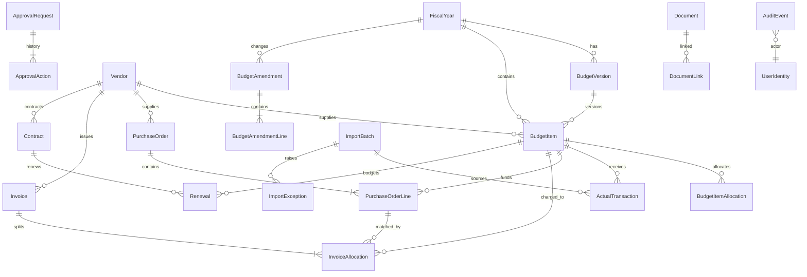

# Initial ERD

The physical schema will add explicit lookup tables, bridge tables, uniqueness constraints, check constraints, filtered indexes, and `rowversion` columns as each module is implemented.
